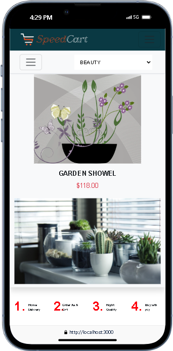

# Speed Cart - React.js Template

This project is a React.js template project designed to help you learn and experiment with various React concepts. Speed Cart provides a solid foundation for building responsive and dynamic web applications.

## Live Demo

[](https://speed-cart.onrender.com)

---

## Features

- **Responsive Design:** Speed Cart is built with responsiveness in mind, ensuring a smooth user experience across devices of all sizes.

- **Dynamic Components:** Learn how to create dynamic React components to enhance interactivity and flexibility in your web applications.

- **Routing:** Utilize React Router to implement a multi-page experience within a single-page application, enabling easy navigation between different sections of your site.

- **State Management:** Explore various state management approaches in React, including Context API and useContext hook, to effectively manage and manipulate the application's state.

- **Animation:** Incorporate animation libraries like [React Spring](https://www.react-spring.io/) to add fluid and visually appealing animations to your UI elements.

- **Data Fetching:** Fetch product or category data from external APIs like [DummyJSON](https://dummyjson.com/) to dynamically populate your application with content.

## Usage

1. **Clone the repository:**

   ```bash
   git clone https://github.com/Alihamza0007/speed-cart.git
   cd speed-cart
   ```

2. **Install dependencies:**

   ```bash
   npm install
   ```

3. **Start the development server:**

   ```bash
   npm start
   ```

4. **Open your browser and visit [http://localhost:3000](http://localhost:3000).**

---

**Credits**

This project's design and content were inspired by Speed Cart. We appreciate their work and contribution to the community.

**Contributing**

We welcome contributions from the community! If you'd like to contribute, please consider the following steps:

1. **Fork the repository:** Create a copy of this repository on your GitHub account.
2. **Clone your fork locally:** Clone the forked repository to your local machine.
3. **Create a branch:** Create a new branch for your specific changes.
4. **Make changes:** Implement your desired modifications.
5. **Test your changes:** Thoroughly test your changes to ensure they don't introduce any regressions.
6. **Commit your changes:** Commit your changes to your local branch.
7. **Push to your fork:** Push your local branch to your forked repository on GitHub.
8. **Create a pull request:** Create a pull request on GitHub requesting that your changes be merged into the main branch of this repository.

We'll review your pull request and provide feedback before merging it.

**License**

## This project is licensed under the [MIT License](LICENSE) - see the LICENSE file for details. Please respect the licensing terms when using or modifying this project.

**Project Images**

<div class="d-flex">





</div>
